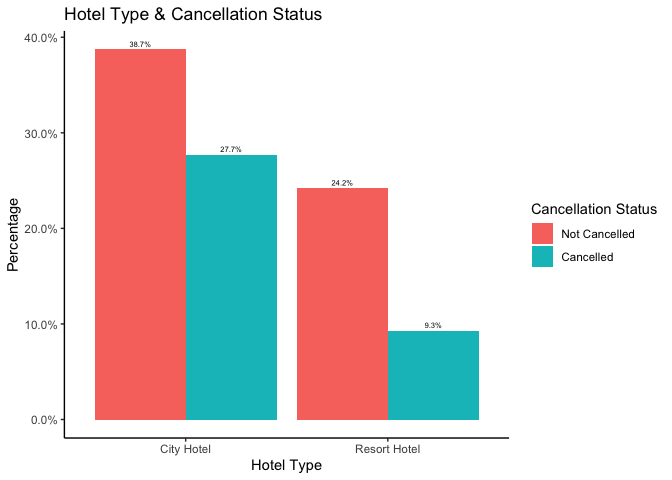

EDA-Hotel Bookings
================
Roy Wu
11/05/2021


#### 1\. About the Dataset

The dataset used in this exploratory data analysis comes from the [Hotel
Booking
Demand](https://www.kaggle.com/jessemostipak/hotel-booking-demand)
dataset on Kaggle. The purpose of this project is to utilize packages in
tidyverse (dplyr and ggplot2) to manipulate and visualize data.

``` r
library(tidyverse)
hotel <- read.csv("hotel_bookings.csv")
```

#### 2\. Data Observation

The first step is to understand the variables in the dataset. Through
the preliminary observation of the dataset, it can be identified that a
majority of the variables are string/character types. It would be
helpful to convert these variables to categorical variables. This step
is crucial for further data analysis.

``` r
class(hotel)
```

    ## [1] "data.frame"

``` r
str(hotel)
```

    ## 'data.frame':    119390 obs. of  32 variables:
    ##  $ hotel                         : chr  "Resort Hotel" "Resort Hotel" "Resort Hotel" "Resort Hotel" ...
    ##  $ is_canceled                   : int  0 0 0 0 0 0 0 0 1 1 ...
    ##  $ lead_time                     : int  342 737 7 13 14 14 0 9 85 75 ...
    ##  $ arrival_date_year             : int  2015 2015 2015 2015 2015 2015 2015 2015 2015 2015 ...
    ##  $ arrival_date_month            : chr  "July" "July" "July" "July" ...
    ##  $ arrival_date_week_number      : int  27 27 27 27 27 27 27 27 27 27 ...
    ##  $ arrival_date_day_of_month     : int  1 1 1 1 1 1 1 1 1 1 ...
    ##  $ stays_in_weekend_nights       : int  0 0 0 0 0 0 0 0 0 0 ...
    ##  $ stays_in_week_nights          : int  0 0 1 1 2 2 2 2 3 3 ...
    ##  $ adults                        : int  2 2 1 1 2 2 2 2 2 2 ...
    ##  $ children                      : int  0 0 0 0 0 0 0 0 0 0 ...
    ##  $ babies                        : int  0 0 0 0 0 0 0 0 0 0 ...
    ##  $ meal                          : chr  "BB" "BB" "BB" "BB" ...
    ##  $ country                       : chr  "PRT" "PRT" "GBR" "GBR" ...
    ##  $ market_segment                : chr  "Direct" "Direct" "Direct" "Corporate" ...
    ##  $ distribution_channel          : chr  "Direct" "Direct" "Direct" "Corporate" ...
    ##  $ is_repeated_guest             : int  0 0 0 0 0 0 0 0 0 0 ...
    ##  $ previous_cancellations        : int  0 0 0 0 0 0 0 0 0 0 ...
    ##  $ previous_bookings_not_canceled: int  0 0 0 0 0 0 0 0 0 0 ...
    ##  $ reserved_room_type            : chr  "C" "C" "A" "A" ...
    ##  $ assigned_room_type            : chr  "C" "C" "C" "A" ...
    ##  $ booking_changes               : int  3 4 0 0 0 0 0 0 0 0 ...
    ##  $ deposit_type                  : chr  "No Deposit" "No Deposit" "No Deposit" "No Deposit" ...
    ##  $ agent                         : chr  "NULL" "NULL" "NULL" "304" ...
    ##  $ company                       : chr  "NULL" "NULL" "NULL" "NULL" ...
    ##  $ days_in_waiting_list          : int  0 0 0 0 0 0 0 0 0 0 ...
    ##  $ customer_type                 : chr  "Transient" "Transient" "Transient" "Transient" ...
    ##  $ adr                           : num  0 0 75 75 98 ...
    ##  $ required_car_parking_spaces   : int  0 0 0 0 0 0 0 0 0 0 ...
    ##  $ total_of_special_requests     : int  0 0 0 0 1 1 0 1 1 0 ...
    ##  $ reservation_status            : chr  "Check-Out" "Check-Out" "Check-Out" "Check-Out" ...
    ##  $ reservation_status_date       : chr  "2015-07-01" "2015-07-01" "2015-07-02" "2015-07-02" ...

``` r
hotel <- mutate_if(hotel, is.character, as.factor)
str(hotel)
```

    ## 'data.frame':    119390 obs. of  32 variables:
    ##  $ hotel                         : Factor w/ 2 levels "City Hotel","Resort Hotel": 2 2 2 2 2 2 2 2 2 2 ...
    ##  $ is_canceled                   : int  0 0 0 0 0 0 0 0 1 1 ...
    ##  $ lead_time                     : int  342 737 7 13 14 14 0 9 85 75 ...
    ##  $ arrival_date_year             : int  2015 2015 2015 2015 2015 2015 2015 2015 2015 2015 ...
    ##  $ arrival_date_month            : Factor w/ 12 levels "April","August",..: 6 6 6 6 6 6 6 6 6 6 ...
    ##  $ arrival_date_week_number      : int  27 27 27 27 27 27 27 27 27 27 ...
    ##  $ arrival_date_day_of_month     : int  1 1 1 1 1 1 1 1 1 1 ...
    ##  $ stays_in_weekend_nights       : int  0 0 0 0 0 0 0 0 0 0 ...
    ##  $ stays_in_week_nights          : int  0 0 1 1 2 2 2 2 3 3 ...
    ##  $ adults                        : int  2 2 1 1 2 2 2 2 2 2 ...
    ##  $ children                      : int  0 0 0 0 0 0 0 0 0 0 ...
    ##  $ babies                        : int  0 0 0 0 0 0 0 0 0 0 ...
    ##  $ meal                          : Factor w/ 5 levels "BB","FB","HB",..: 1 1 1 1 1 1 1 2 1 3 ...
    ##  $ country                       : Factor w/ 178 levels "ABW","AGO","AIA",..: 137 137 60 60 60 60 137 137 137 137 ...
    ##  $ market_segment                : Factor w/ 8 levels "Aviation","Complementary",..: 4 4 4 3 7 7 4 4 7 6 ...
    ##  $ distribution_channel          : Factor w/ 5 levels "Corporate","Direct",..: 2 2 2 1 4 4 2 2 4 4 ...
    ##  $ is_repeated_guest             : int  0 0 0 0 0 0 0 0 0 0 ...
    ##  $ previous_cancellations        : int  0 0 0 0 0 0 0 0 0 0 ...
    ##  $ previous_bookings_not_canceled: int  0 0 0 0 0 0 0 0 0 0 ...
    ##  $ reserved_room_type            : Factor w/ 10 levels "A","B","C","D",..: 3 3 1 1 1 1 3 3 1 4 ...
    ##  $ assigned_room_type            : Factor w/ 12 levels "A","B","C","D",..: 3 3 3 1 1 1 3 3 1 4 ...
    ##  $ booking_changes               : int  3 4 0 0 0 0 0 0 0 0 ...
    ##  $ deposit_type                  : Factor w/ 3 levels "No Deposit","Non Refund",..: 1 1 1 1 1 1 1 1 1 1 ...
    ##  $ agent                         : Factor w/ 334 levels "1","10","103",..: 334 334 334 157 103 103 334 156 103 40 ...
    ##  $ company                       : Factor w/ 353 levels "10","100","101",..: 353 353 353 353 353 353 353 353 353 353 ...
    ##  $ days_in_waiting_list          : int  0 0 0 0 0 0 0 0 0 0 ...
    ##  $ customer_type                 : Factor w/ 4 levels "Contract","Group",..: 3 3 3 3 3 3 3 3 3 3 ...
    ##  $ adr                           : num  0 0 75 75 98 ...
    ##  $ required_car_parking_spaces   : int  0 0 0 0 0 0 0 0 0 0 ...
    ##  $ total_of_special_requests     : int  0 0 0 0 1 1 0 1 1 0 ...
    ##  $ reservation_status            : Factor w/ 3 levels "Canceled","Check-Out",..: 2 2 2 2 2 2 2 2 1 1 ...
    ##  $ reservation_status_date       : Factor w/ 926 levels "2014-10-17","2014-11-18",..: 122 122 123 123 124 124 124 124 73 62 ...

``` r
summary(hotel)
```

    ##           hotel        is_canceled       lead_time   arrival_date_year
    ##  City Hotel  :79330   Min.   :0.0000   Min.   :  0   Min.   :2015     
    ##  Resort Hotel:40060   1st Qu.:0.0000   1st Qu.: 18   1st Qu.:2016     
    ##                       Median :0.0000   Median : 69   Median :2016     
    ##                       Mean   :0.3704   Mean   :104   Mean   :2016     
    ##                       3rd Qu.:1.0000   3rd Qu.:160   3rd Qu.:2017     
    ##                       Max.   :1.0000   Max.   :737   Max.   :2017     
    ##                                                                       
    ##  arrival_date_month arrival_date_week_number arrival_date_day_of_month
    ##  August :13877      Min.   : 1.00            Min.   : 1.0             
    ##  July   :12661      1st Qu.:16.00            1st Qu.: 8.0             
    ##  May    :11791      Median :28.00            Median :16.0             
    ##  October:11160      Mean   :27.17            Mean   :15.8             
    ##  April  :11089      3rd Qu.:38.00            3rd Qu.:23.0             
    ##  June   :10939      Max.   :53.00            Max.   :31.0             
    ##  (Other):47873                                                        
    ##  stays_in_weekend_nights stays_in_week_nights     adults      
    ##  Min.   : 0.0000         Min.   : 0.0         Min.   : 0.000  
    ##  1st Qu.: 0.0000         1st Qu.: 1.0         1st Qu.: 2.000  
    ##  Median : 1.0000         Median : 2.0         Median : 2.000  
    ##  Mean   : 0.9276         Mean   : 2.5         Mean   : 1.856  
    ##  3rd Qu.: 2.0000         3rd Qu.: 3.0         3rd Qu.: 2.000  
    ##  Max.   :19.0000         Max.   :50.0         Max.   :55.000  
    ##                                                               
    ##     children           babies                 meal          country     
    ##  Min.   : 0.0000   Min.   : 0.000000   BB       :92310   PRT    :48590  
    ##  1st Qu.: 0.0000   1st Qu.: 0.000000   FB       :  798   GBR    :12129  
    ##  Median : 0.0000   Median : 0.000000   HB       :14463   FRA    :10415  
    ##  Mean   : 0.1039   Mean   : 0.007949   SC       :10650   ESP    : 8568  
    ##  3rd Qu.: 0.0000   3rd Qu.: 0.000000   Undefined: 1169   DEU    : 7287  
    ##  Max.   :10.0000   Max.   :10.000000                     ITA    : 3766  
    ##  NA's   :4                                               (Other):28635  
    ##        market_segment  distribution_channel is_repeated_guest
    ##  Online TA    :56477   Corporate: 6677      Min.   :0.00000  
    ##  Offline TA/TO:24219   Direct   :14645      1st Qu.:0.00000  
    ##  Groups       :19811   GDS      :  193      Median :0.00000  
    ##  Direct       :12606   TA/TO    :97870      Mean   :0.03191  
    ##  Corporate    : 5295   Undefined:    5      3rd Qu.:0.00000  
    ##  Complementary:  743                        Max.   :1.00000  
    ##  (Other)      :  239                                         
    ##  previous_cancellations previous_bookings_not_canceled reserved_room_type
    ##  Min.   : 0.00000       Min.   : 0.0000                A      :85994     
    ##  1st Qu.: 0.00000       1st Qu.: 0.0000                D      :19201     
    ##  Median : 0.00000       Median : 0.0000                E      : 6535     
    ##  Mean   : 0.08712       Mean   : 0.1371                F      : 2897     
    ##  3rd Qu.: 0.00000       3rd Qu.: 0.0000                G      : 2094     
    ##  Max.   :26.00000       Max.   :72.0000                B      : 1118     
    ##                                                        (Other): 1551     
    ##  assigned_room_type booking_changes       deposit_type        agent      
    ##  A      :74053      Min.   : 0.0000   No Deposit:104641   9      :31961  
    ##  D      :25322      1st Qu.: 0.0000   Non Refund: 14587   NULL   :16340  
    ##  E      : 7806      Median : 0.0000   Refundable:   162   240    :13922  
    ##  F      : 3751      Mean   : 0.2211                       1      : 7191  
    ##  G      : 2553      3rd Qu.: 0.0000                       14     : 3640  
    ##  C      : 2375      Max.   :21.0000                       7      : 3539  
    ##  (Other): 3530                                            (Other):42797  
    ##     company       days_in_waiting_list         customer_type  
    ##  NULL   :112593   Min.   :  0.000      Contract       : 4076  
    ##  40     :   927   1st Qu.:  0.000      Group          :  577  
    ##  223    :   784   Median :  0.000      Transient      :89613  
    ##  67     :   267   Mean   :  2.321      Transient-Party:25124  
    ##  45     :   250   3rd Qu.:  0.000                             
    ##  153    :   215   Max.   :391.000                             
    ##  (Other):  4354                                               
    ##       adr          required_car_parking_spaces total_of_special_requests
    ##  Min.   :  -6.38   Min.   :0.00000             Min.   :0.0000           
    ##  1st Qu.:  69.29   1st Qu.:0.00000             1st Qu.:0.0000           
    ##  Median :  94.58   Median :0.00000             Median :0.0000           
    ##  Mean   : 101.83   Mean   :0.06252             Mean   :0.5714           
    ##  3rd Qu.: 126.00   3rd Qu.:0.00000             3rd Qu.:1.0000           
    ##  Max.   :5400.00   Max.   :8.00000             Max.   :5.0000           
    ##                                                                         
    ##  reservation_status reservation_status_date
    ##  Canceled :43017    2015-10-21:  1461      
    ##  Check-Out:75166    2015-07-06:   805      
    ##  No-Show  : 1207    2016-11-25:   790      
    ##                     2015-01-01:   763      
    ##                     2016-01-18:   625      
    ##                     2015-07-02:   469      
    ##                     (Other)   :114477

#### 3\. Data Cleaning

This step helps to improve data quality. By summarizing the entire
dataset, we see some variables contain missing values and “noisy” data
that might be outliers. For example, outliers include 55 adults and 10
babies for each reservation. The goal of this step is to smooth the
dataset and resolve inconsistencies.

The following data cleaning approaches were executed in this step:

  - Assigning missing values for the number of children to 0
  - Assigning missing values for meal type to “SC” (self-catering: no
    meals are included)
  - Subsetting a data frame that retains all rows where the number of
    babies is equal or less than 2, the number of adults is equal or
    less than 4, and distribution channel that is not unidentified

<!-- end list -->

``` r
summary(hotel$adults)
```

    ##    Min. 1st Qu.  Median    Mean 3rd Qu.    Max. 
    ##   0.000   2.000   2.000   1.856   2.000  55.000

``` r
summary(hotel$children)
```

    ##    Min. 1st Qu.  Median    Mean 3rd Qu.    Max.    NA's 
    ##  0.0000  0.0000  0.0000  0.1039  0.0000 10.0000       4

``` r
summary(hotel$babies)
```

    ##      Min.   1st Qu.    Median      Mean   3rd Qu.      Max. 
    ##  0.000000  0.000000  0.000000  0.007949  0.000000 10.000000

``` r
summary(hotel$meal)
```

    ##        BB        FB        HB        SC Undefined 
    ##     92310       798     14463     10650      1169

``` r
hotel$children[is.na(hotel$children)] <- 0
hotel$meal[hotel$meal == 'Undefined'] <- "SC"

hotel <- filter(hotel, babies <= 2 & adults <= 4 & distribution_channel != "Undefined")
```

#### 4\. Data Visualization

The final and most exciting step — data visualization. This step
analyzes relationships between variables and provides insights into
patterns and trends.

**(1).What are the hotel types and how many of each type are there?**  
There are two hotel types in this dataset: City Hotel and Resort Hotel.
The number of reservation cancellations for city hotels is almost twice
as much as that of resort hotels.

``` r
ggplot(data = hotel) +
  geom_bar(aes(hotel, fill = hotel),width = 0.7) +
  xlab("Hotel Type") +
  ylab("Number of Hotels") +
  scale_fill_discrete(name = "Hotel Type ")+
  theme_classic()
```

<!-- -->

**(2).What is the cancellation status for each hotel type?**  
The amount of cancellation for city hotels is considerably higher
compared to that of resort hotels. This could be attributed to several
reasons:

  - Resort bookings are often bundled with flight bookings and/or car
    rentals in holiday packages, resulting in less flexibility in terms
    of reservation modification.
  - Resorts hotels have stricter cancellation policies
      - Guests staying at city hotels are usually business travellers,
        transient travellers and “steamliners” who are often
        on-the-move. These types of travellers usually do not need much
        time to book in advance; they seek convenience and flexibility
        with their reservations.  
      - In contrast, since resort hotels are at tourist destinations,
        guests usually book in advance according to their travel plans.
        This gives them less freedom in modifying their reservations.

<!-- end list -->

``` r
notcancelled <- filter(hotel, is_canceled == 0)

meanadr <- mean(notcancelled$adr)
meanadr
```

    ## [1] 99.9878

``` r
prop.table(table(hotel$is_canceled, hotel$hotel))
```

    ##    
    ##     City Hotel Resort Hotel
    ##   0 0.38725946   0.24242043
    ##   1 0.27727932   0.09304079

``` r
ggplot(data = hotel,
       aes(hotel, prop.table(stat(count)),
         fill = factor(is_canceled),
         label = scales::percent(prop.table(stat(count)))
       )) +
  geom_bar(position = position_dodge())+
  geom_text(stat = 'count',
            position = position_dodge(.9), 
              vjust = -0.5, 
              size = 2) + 
  scale_y_continuous(labels = scales::percent) +
  xlab("Hotel Type") +
  ylab("Percentage") +
  scale_fill_discrete(name = "Cancellation Status", 
                      labels = c("Not Cancelled","Cancelled")) +
  labs(title = "Hotel Type & Cancellation Status") +
  theme_classic()
```

<!-- -->

**(3).What is the ADR (Average Daily Rate) among different room
types?**  
The box plot illustrates the ADR across all room types in city hotels
and resort hotels. The data only includes reservations that are not
cancelled. As the ADR varies significantly in the dataset, the ADR axis
is logarithmic-transformed into log10 scale for better readability.

The grey line crossing the graph indicates the mean value of ADR for
reservations that are not cancelled.

``` r
ggplot(data = notcancelled,
       aes(x=assigned_room_type, adr, fill = hotel)) +
  geom_boxplot(size=0.5)+
  scale_y_log10()+
  theme_classic()+
  scale_fill_discrete (name = "Hotel Type") +
  geom_hline(yintercept = meanadr, color = "darkgrey", linetype =1 )+
  xlab("Assigned Room Type") +
  ylab("Average Daily Rate")+
  labs(title = "Average Daily Rate Across All Room Types") +
  annotate("label", label = "Mean ADR", x = 9.5, y = meanadr + 50, size = 4, colour = "red") +
  coord_flip() +
  ylim(0,500)
```

<!-- -->

**(4).What is the ADR (Average Daily Rate) among different distribution
channels?**  
The density plot above represents the distribution of ADR by
distribution channel. It is observed that all distribution channels tend
to have an ADR close to $100 in local currency.

``` r
ggplot(notcancelled, aes(adr, color = distribution_channel))+
  geom_density(size=0.7) +
  theme_classic() +
  xlab("Average Daily Rate")+
  ylab("Density") +
  labs(title = "Average Daily Rate By Distribution Channel")+
  scale_color_discrete(name = "Distribution Channel")
```

<!-- -->

**(5).What booking channels are reservations booked from?**  
Bar graphs above show that out of corporate, direct booking, GDB (Global
distribution system), and Travel Agents/Tour Operators (TA/TO), the book
channel that is utilized the most for hotels bookings is through Travel
Agents/Tour Operators for both city hotels and resort hotels.

``` r
ggplot(hotel, aes(x = distribution_channel, fill = distribution_channel))+
  geom_bar()+
  facet_wrap(~hotel) +
  theme_classic() +
  ylab("Number of Bookins")+
  xlab("Distribution Channel")+
  scale_fill_discrete (name = "Distribution Channel")+
  labs(title = "Booking Channels For Each Hotel Type") 
```

<!-- -->

**(6).What type of guest represent most hotel bookings?**  
It is observed that about 75% of bookings are from transient-party
guests.

``` r
customerdata <- hotel %>%
  dplyr::select(customer_type) %>%
  group_by(customer_type) %>%
  summarize(n = n()) 

ggplot(customerdata, aes(x = "", y = n, fill = customer_type)) +
  geom_bar(width = 1, stat = "identity") +
  coord_polar("y", start = 0) +
  theme_void() +
  scale_fill_discrete (name = "Customer Type")+
  labs(title = "Percentage of Bookings by Customer Type") 
```

<!-- -->
