Project 1
================
Roy Wu
07/05/2021

\#\#\#\#Data Cleaning Import packages

``` r
library(tidyverse)
```

    ## ── Attaching packages ─────────────────────────────────────── tidyverse 1.3.0 ──

    ## ✓ ggplot2 3.3.3     ✓ purrr   0.3.4
    ## ✓ tibble  3.0.5     ✓ dplyr   1.0.2
    ## ✓ tidyr   1.1.2     ✓ stringr 1.4.0
    ## ✓ readr   1.4.0     ✓ forcats 0.5.0

    ## ── Conflicts ────────────────────────────────────────── tidyverse_conflicts() ──
    ## x dplyr::filter() masks stats::filter()
    ## x dplyr::lag()    masks stats::lag()

``` r
library(stargazer)
```

    ## 
    ## Please cite as:

    ##  Hlavac, Marek (2018). stargazer: Well-Formatted Regression and Summary Statistics Tables.

    ##  R package version 5.2.2. https://CRAN.R-project.org/package=stargazer

``` r
library(haven)
```

Import the Dataset

``` r
CRIME2 <- read_dta("~/Documents/University/\U0001f4c8ECON 3740 /Data Sets- STATA/CRIME2.DTA")
```

Filter out the 1987 and 1982 dataset separately

``` r
year87 <- filter(CRIME2, d87==1)
year82 <- filter(CRIME2, d87==0)
```

Add crime rates in 1982 (crmrte82) to the ‘year87’ dataset as an
independent variable ‘crmrte82’Rename crime rates in 1987 to ’crmrte87’

``` r
year87 <- 
  mutate(year87,
         crmrte82 = year82$crmrte,
         crmrte87 = year87$crmrte,
         lcrmrte82 = year82$lcrmrte,
         lcrmrte87 = year87$lcrmrte)
```

\#\#\#\#Model 1

``` r
model_1 <- lm(crmrte87 ~ pcinc + lawexpc + pop + unem + crmrte82, year87)
summary(model_1)
```

    ## 
    ## Call:
    ## lm(formula = crmrte87 ~ pcinc + lawexpc + pop + unem + crmrte82, 
    ##     data = year87)
    ## 
    ## Residuals:
    ##     Min      1Q  Median      3Q     Max 
    ## -38.103 -13.220  -3.124  14.083  46.558 
    ## 
    ## Coefficients:
    ##               Estimate Std. Error t value Pr(>|t|)    
    ## (Intercept) -5.302e+01  3.709e+01  -1.429    0.161    
    ## pcinc        3.291e-03  2.012e-03   1.636    0.110    
    ## lawexpc     -1.466e-02  1.006e-02  -1.458    0.153    
    ## pop         -1.256e-06  1.313e-05  -0.096    0.924    
    ## unem         1.847e+00  2.416e+00   0.764    0.449    
    ## crmrte82     1.309e+00  1.476e-01   8.865 5.53e-11 ***
    ## ---
    ## Signif. codes:  0 '***' 0.001 '**' 0.01 '*' 0.05 '.' 0.1 ' ' 1
    ## 
    ## Residual standard error: 20.87 on 40 degrees of freedom
    ## Multiple R-squared:   0.68,  Adjusted R-squared:   0.64 
    ## F-statistic:    17 on 5 and 40 DF,  p-value: 5.408e-09

``` r
plot(model_1)
```

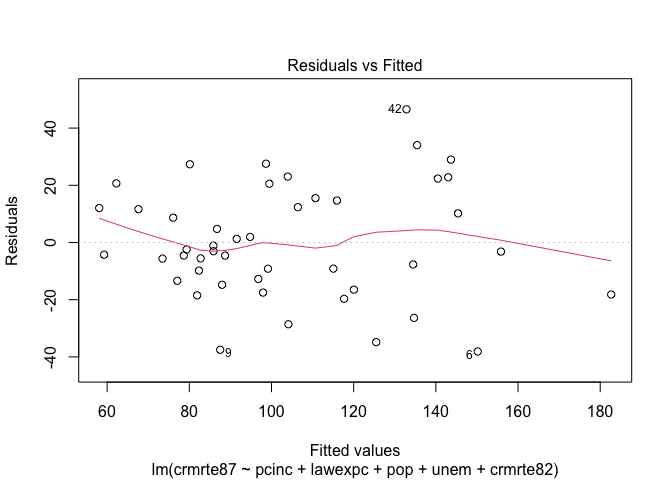<!-- -->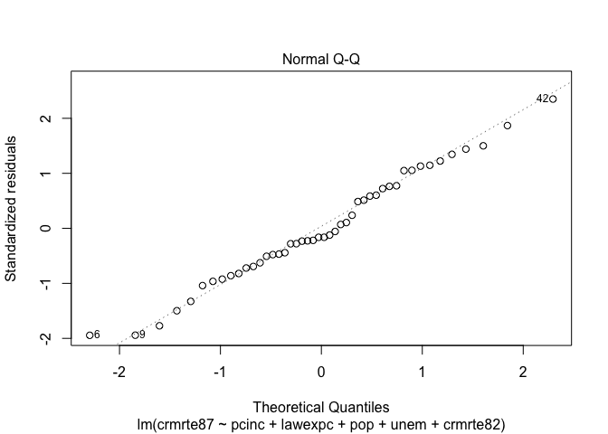<!-- -->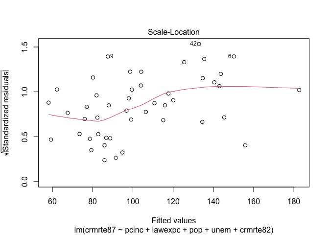<!-- -->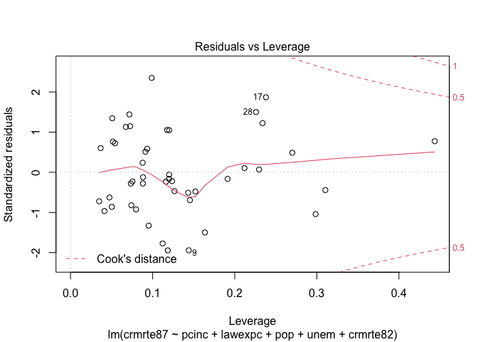<!-- -->

\#\#\#\#Model 2

``` r
model_2 <- lm(lcrmrte87 ~ unem + llawexpc + lcrmrte82, year87)
summary(model_2)
```

    ## 
    ## Call:
    ## lm(formula = lcrmrte87 ~ unem + llawexpc + lcrmrte82, data = year87)
    ## 
    ## Residuals:
    ##      Min       1Q   Median       3Q      Max 
    ## -0.48081 -0.12202  0.00659  0.14658  0.34428 
    ## 
    ## Coefficients:
    ##              Estimate Std. Error t value Pr(>|t|)    
    ## (Intercept)  0.076451   0.821143   0.093    0.926    
    ## unem         0.008621   0.019517   0.442    0.661    
    ## llawexpc    -0.139576   0.108641  -1.285    0.206    
    ## lcrmrte82    1.193923   0.132099   9.038  2.1e-11 ***
    ## ---
    ## Signif. codes:  0 '***' 0.001 '**' 0.01 '*' 0.05 '.' 0.1 ' ' 1
    ## 
    ## Residual standard error: 0.1905 on 42 degrees of freedom
    ## Multiple R-squared:  0.6798, Adjusted R-squared:  0.657 
    ## F-statistic: 29.73 on 3 and 42 DF,  p-value: 1.799e-10

``` r
plot(model_2)
```

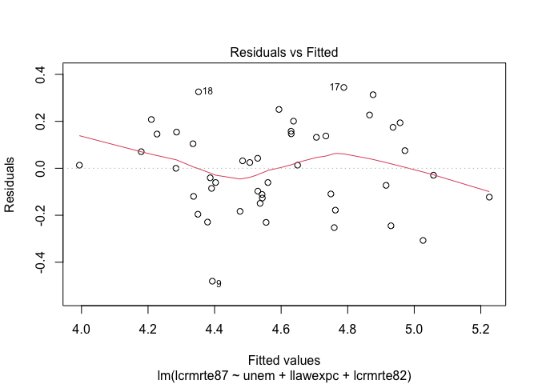<!-- -->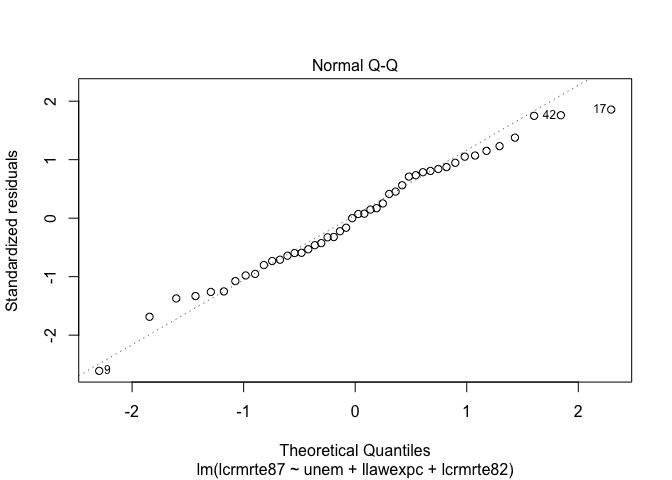<!-- -->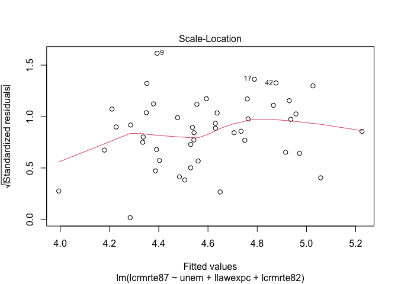<!-- -->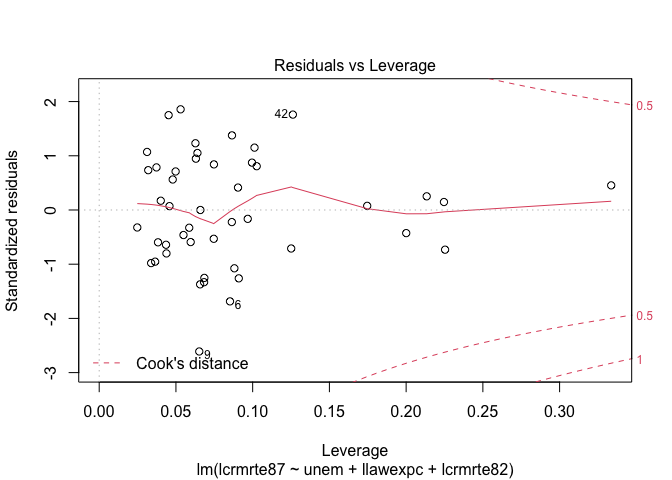<!-- -->

\#\#\#\#Model 3

``` r
model_3 <- lm(crmrte87 ~ pcinc + lawexpc + pop + unem, year87)
summary(model_3)
```

    ## 
    ## Call:
    ## lm(formula = crmrte87 ~ pcinc + lawexpc + pop + unem, data = year87)
    ## 
    ## Residuals:
    ##    Min     1Q Median     3Q    Max 
    ## -52.72 -25.74 -10.35  20.98  82.74 
    ## 
    ## Coefficients:
    ##               Estimate Std. Error t value Pr(>|t|)   
    ## (Intercept)  1.478e+02  4.995e+01   2.958  0.00512 **
    ## pcinc       -2.420e-03  3.241e-03  -0.747  0.45943   
    ## lawexpc      6.999e-03  1.659e-02   0.422  0.67529   
    ## pop          4.640e-06  2.231e-05   0.208  0.83626   
    ## unem        -4.728e+00  3.911e+00  -1.209  0.23366   
    ## ---
    ## Signif. codes:  0 '***' 0.001 '**' 0.01 '*' 0.05 '.' 0.1 ' ' 1
    ## 
    ## Residual standard error: 35.49 on 41 degrees of freedom
    ## Multiple R-squared:  0.05137,    Adjusted R-squared:  -0.04118 
    ## F-statistic: 0.5551 on 4 and 41 DF,  p-value: 0.6965

``` r
plot(model_3)
```

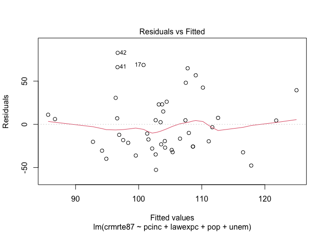<!-- -->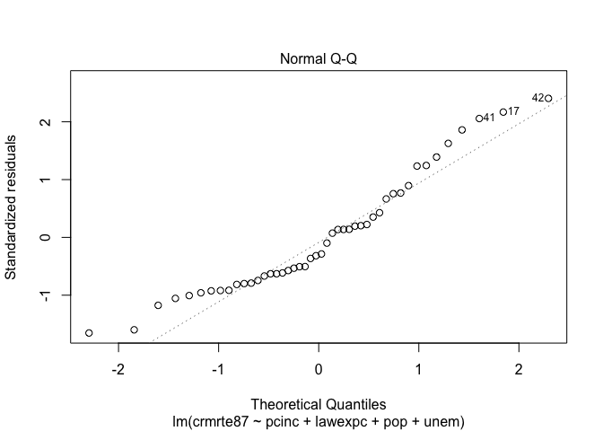<!-- -->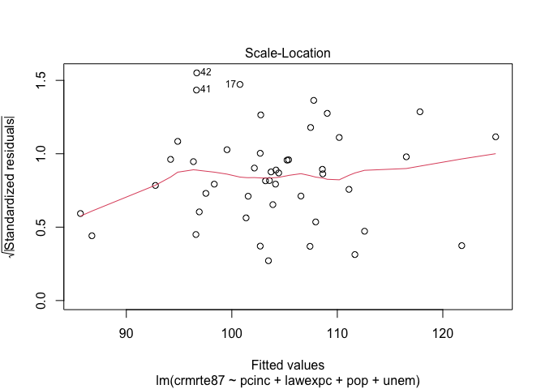<!-- -->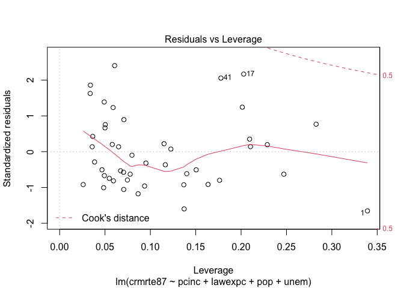<!-- -->
\#\#\#\#Model 4

``` r
model_4 <- lm(lcrmrte87 ~ unem + llawexpc, year87)
summary(model_4)
```

    ## 
    ## Call:
    ## lm(formula = lcrmrte87 ~ unem + llawexpc, data = year87)
    ## 
    ## Residuals:
    ##      Min       1Q   Median       3Q      Max 
    ## -0.64786 -0.22955 -0.06368  0.22183  0.71164 
    ## 
    ## Coefficients:
    ##             Estimate Std. Error t value Pr(>|t|)  
    ## (Intercept)  3.34290    1.25053   2.673   0.0106 *
    ## unem        -0.02900    0.03234  -0.897   0.3748  
    ## llawexpc     0.20337    0.17265   1.178   0.2453  
    ## ---
    ## Signif. codes:  0 '***' 0.001 '**' 0.01 '*' 0.05 '.' 0.1 ' ' 1
    ## 
    ## Residual standard error: 0.3231 on 43 degrees of freedom
    ## Multiple R-squared:  0.05712,    Adjusted R-squared:  0.01326 
    ## F-statistic: 1.302 on 2 and 43 DF,  p-value: 0.2824

``` r
plot(model_4)
```

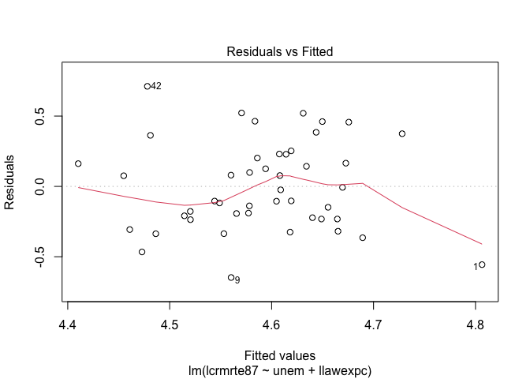<!-- -->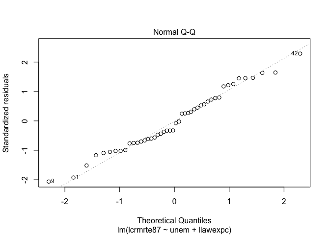<!-- -->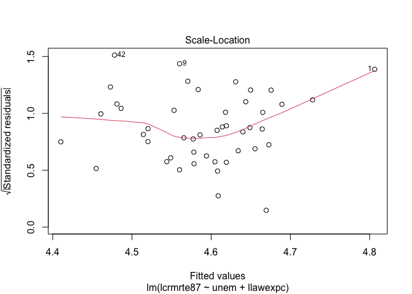<!-- -->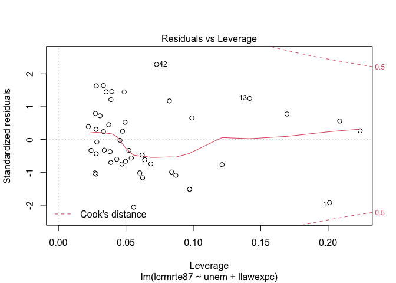<!-- -->
\#\#\#\#Results

``` r
stargazer(model_1, model_2,model_3,model_4, type= "text",title="Regression Results",
          no.space=FALSE,
          align = FALSE) 
```

    ## 
    ## Regression Results
    ## =======================================================================================================
    ##                                                     Dependent variable:                                
    ##                     -----------------------------------------------------------------------------------
    ##                            crmrte87              lcrmrte87             crmrte87          lcrmrte87     
    ##                              (1)                    (2)                  (3)                (4)        
    ## -------------------------------------------------------------------------------------------------------
    ## pcinc                       0.003                                       -0.002                         
    ##                            (0.002)                                     (0.003)                         
    ##                                                                                                        
    ## lawexpc                     -0.015                                      0.007                          
    ##                            (0.010)                                     (0.017)                         
    ##                                                                                                        
    ## pop                        -0.00000                                    0.00000                         
    ##                           (0.00001)                                   (0.00002)                        
    ##                                                                                                        
    ## unem                        1.847                  0.009                -4.728             -0.029      
    ##                            (2.416)                (0.020)              (3.911)            (0.032)      
    ##                                                                                                        
    ## crmrte82                   1.309***                                                                    
    ##                            (0.148)                                                                     
    ##                                                                                                        
    ## llawexpc                                           -0.140                                  0.203       
    ##                                                   (0.109)                                 (0.173)      
    ##                                                                                                        
    ## lcrmrte82                                         1.194***                                             
    ##                                                   (0.132)                                              
    ##                                                                                                        
    ## Constant                   -53.019                 0.076              147.769***          3.343**      
    ##                            (37.090)               (0.821)              (49.951)           (1.251)      
    ##                                                                                                        
    ## -------------------------------------------------------------------------------------------------------
    ## Observations                  46                     46                   46                 46        
    ## R2                          0.680                  0.680                0.051              0.057       
    ## Adjusted R2                 0.640                  0.657                -0.041             0.013       
    ## Residual Std. Error    20.870 (df = 40)       0.191 (df = 42)      35.494 (df = 41)   0.323 (df = 43)  
    ## F Statistic         17.002*** (df = 5; 40) 29.727*** (df = 3; 42) 0.555 (df = 4; 41) 1.302 (df = 2; 43)
    ## =======================================================================================================
    ## Note:                                                                       *p<0.1; **p<0.05; ***p<0.01
